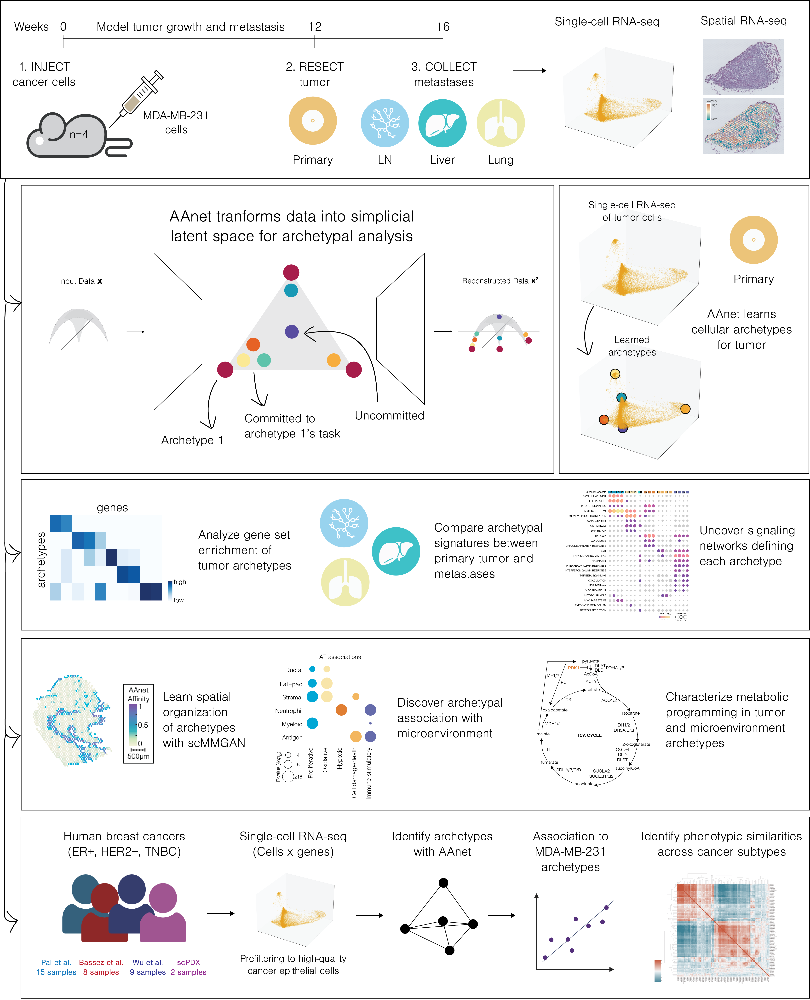

# Archetypal Analysis network (AAnet)

## Quick start

* [Guided tutorial for single-cell analysis](example_notebooks/AAnet_single-cell_example.ipynb)
* [Guided tutorial for simulated simplex](example_notebooks/AAnet_simplex_example.ipynb)
* [Guided tutorial for MNIST digits](example_notebooks/AAnet_MNIST_example.ipynb)

## Introduction

[A. Venkat, S. E. Youlten, B. P. San Juan, et al. AAnet resolves a continuum of spatially-localized cell states to unveil tumor complexity. 2024. bioRxiv](https://www.biorxiv.org/content/10.1101/2024.05.11.593705v1.full)

Identifying functionally important cell states and structure within a heterogeneous tumor remains a significant biological and computational challenge. Moreover, current clustering or trajectory-based computational models are ill-equipped to address the notion that cancer cells reside along a phenotypic continuum. To address this, we present Archetypal Analysis network (AAnet), a neural network that learns key archetypal cell states within a phenotypic continuum of cell states in single-cell data.
